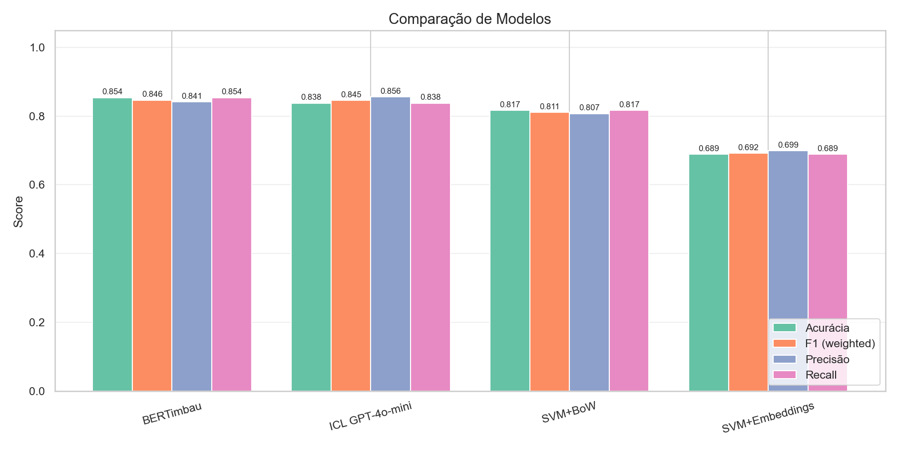
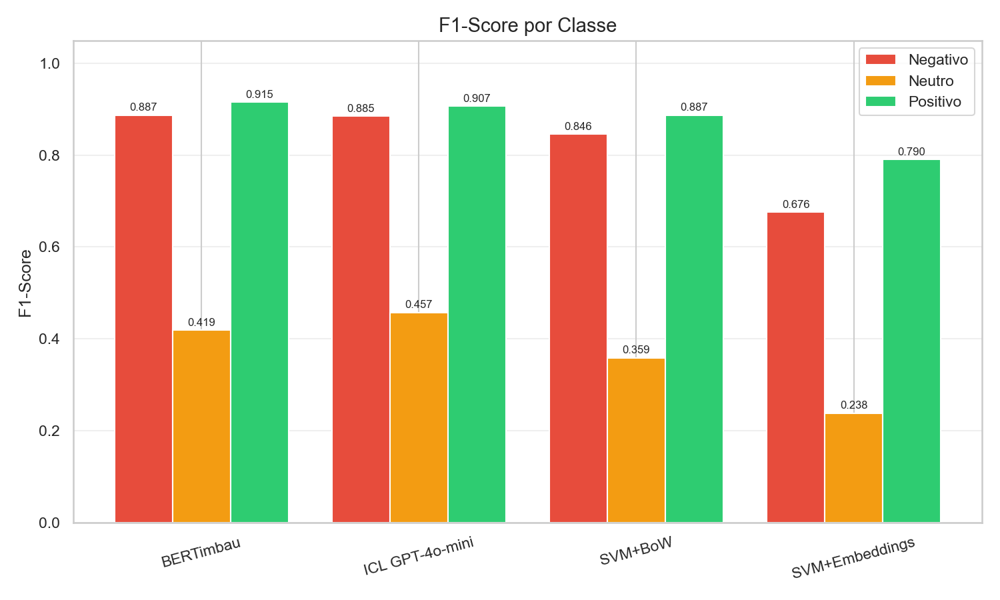
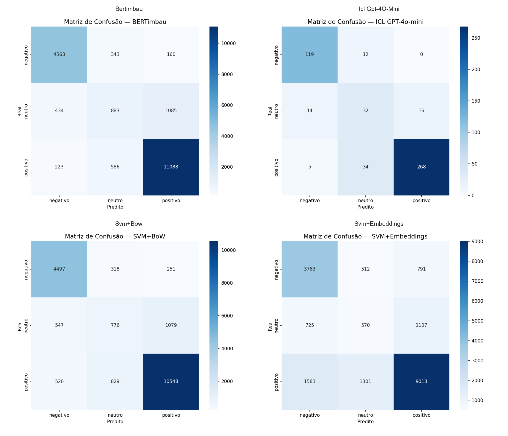

# Análise de Sentimentos em Avaliações de Produtos (B2W)

**Autores:** Pedro Falcão Martins e Ana Paula

Projeto acadêmico do **Módulo 1 de PLN**: implementação e comparação de classificadores de sentimento sobre avaliações reais de produtos brasileiros.

## Dataset

**B2W-Reviews01** — ~132K avaliações de produtos da Americanas.com (HuggingFace: `ruanchaves/b2w-reviews01`).

### Mapeamento de Sentimento (Ternário)

| Rating | Sentimento |
|--------|-----------|
| 1-2    | Negativo  |
| 3      | Neutro    |
| 4-5    | Positivo  |

---

## Resultados

| Modelo | Acurácia | F1 (weighted) | F1 Negativo | F1 Neutro | F1 Positivo |
|--------|----------|---------------|-------------|-----------|-------------|
| **BERTimbau** | **0.8538** | **0.8464** | 0.8872 | 0.4191 | **0.9152** |
| ICL GPT-4o-mini* | 0.8380 | 0.8454 | 0.8848 | **0.4571** | 0.9069 |
| SVM + TF-IDF | 0.8170 | 0.8110 | 0.8461 | 0.3588 | 0.8873 |
| SVM + Embeddings | 0.6892 | 0.6919 | 0.6758 | 0.2382 | 0.7903 |

\* ICL avaliado em subset estratificado de 500 amostras (vs ~19K do teste completo para os demais modelos).

### Principais Descobertas

- **BERTimbau** obteve o melhor desempenho geral (F1=0.846), treinado com subset de 30K amostras
- **ICL GPT-4o-mini** surpreendeu com F1=0.845 **sem nenhum treinamento** (few-shot, 500 amostras)
- **SVM + TF-IDF** é um baseline forte e eficiente (F1=0.811, treino em ~5min CPU)
- **Classe neutro** é a mais difícil para todos os modelos (F1 entre 0.24-0.46)
- **SVM + Embeddings** usou spaCy 96d como fallback (com FastText 300d o resultado seria superior)

### Gráficos

| Comparação de Modelos | F1 por Classe |
|---|---|
|  |  |

| Matrizes de Confusão |
|---|
|  |

---

## Modelos Implementados

| Modelo | Descrição | Notebook |
|--------|-----------|----------|
| SVM + TF-IDF | LinearSVC com TF-IDF (50K features, uni+bigrams) | `03_svm_bow.ipynb` |
| SVM + Embeddings | SVC (RBF) com spaCy embeddings 96d (mean pooling) | `04_svm_embeddings.ipynb` |
| BERTimbau | Fine-tuning de `neuralmind/bert-base-portuguese-cased` | `05_bert.ipynb` |
| ICL GPT-4o-mini | Few-shot com GPT-4o-mini (bônus, 500 amostras) | `06_icl_claude.ipynb` |

## Instalação

```bash
# Clonar o repositório
git clone https://github.com/pfalconiere/pln-exercise-master-sentiment-analysis.git
cd pln-exercise-master-sentiment-analysis

# Instalar dependências
poetry install

# Downloads NLP
poetry run python -m spacy download pt_core_news_sm
poetry run python -c "import nltk; nltk.download('stopwords'); nltk.download('rslp')"

# (Opcional) Para o notebook 06 — ICL com LLM
cp .env.example .env
# Edite .env com sua OPENAI_API_KEY
```

### Embeddings (para notebook 04)

O notebook 04 usa spaCy `pt_core_news_sm` (96d) como fallback automático. Para resultados melhores, baixe embeddings FastText e coloque em `data/embeddings/`:
- [NILC Embeddings](http://nilc.icmc.usp.br/embeddings) — `cbow_s300.txt`
- Alternativa: [Facebook FastText](https://fasttext.cc/docs/en/crawl-vectors.html) — `cc.pt.300.bin`

## Execução

Execute os notebooks na ordem:

```bash
poetry run jupyter notebook
```

1. `01_exploracao_dados.ipynb` — EDA e criação dos splits
2. `02_preprocessamento.ipynb` — Pipeline de limpeza
3. `03_svm_bow.ipynb` — SVM + TF-IDF
4. `04_svm_embeddings.ipynb` — SVM + Embeddings
5. `05_bert.ipynb` — BERTimbau fine-tuning (~30-60min no MPS)
6. `06_icl_claude.ipynb` — ICL com LLM (requer API key)
7. `07_comparacao_final.ipynb` — Comparação consolidada

## Estrutura do Projeto

```
├── pyproject.toml          # Dependências (Poetry)
├── .env.example            # Template para API keys
├── src/
│   ├── config.py           # Constantes e hiperparâmetros
│   ├── data_loader.py      # Download, mapeamento, splits
│   ├── preprocessing.py    # Limpeza, stopwords, stemming
│   ├── feature_extraction.py # TF-IDF, embeddings
│   ├── evaluation.py       # Métricas e visualizações
│   └── utils.py            # Seed, device, timing
├── notebooks/              # 7 notebooks reproduzíveis
├── data/                   # Dados (gitignored)
├── models/                 # Artefatos salvos (gitignored)
├── figures/                # Gráficos exportados
└── tasks/                  # Tracking e lições aprendidas
```

## Configuração

- **Split**: 70/15/15 estratificado (~93K treino, ~20K val, ~20K teste)
- **Seed**: 42 (reprodutibilidade)
- **BERT**: 3 épocas, lr=2e-5, batch=16, max_length=128, subset 30K treino
- **SVM BoW**: LinearSVC, GridSearch C=[0.1, 1, 10]
- **SVM Emb**: SVC RBF, GridSearch C=[0.1,1,10,100], gamma=[scale, auto], subsample 10K
- **ICL**: GPT-4o-mini, 6 exemplos few-shot, 500 amostras do teste

## Licença

Dataset B2W-Reviews01: CC-BY-4.0
